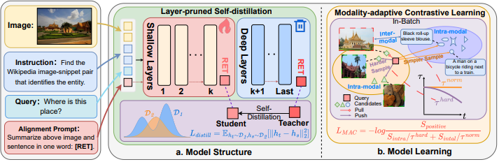
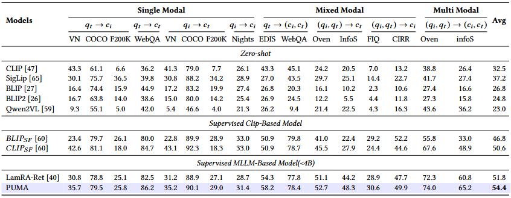

<!-- <h1>JiuTian (九天) </h1> -->
<h2 class="papername">  PUMA: Layer-Pruned Language Model for Efficient Unified Multimodal Retrieval with Modality-Adaptive Learning</h2>

    <a href="https://weberLyu.github.io" target="_blank">Yibo Lyu</a>,
    <a href="https://rshaojimmy.github.io/" target="_blank">Rui Shao*</a>,
    <a href="https://scholar.google.com/citations?user=Mpg0w3cAAAAJ&hl=en&oi=ao" target="_blank">Gongwei Chen</a>,
    <a href="https://scholar.google.com.hk/citations?user=0GtAUPoAAAAJ&hl=zh-CN&oi=sra" target="_blank">Yijie Zhu</a>,
    <a href="http://faculty.hitsz.edu.cn/guanweili" target="_blank">Weili Guan</a>,
    <a href="https://scholar.google.com/citations?hl=en&user=yywVMhUAAAAJ" target="_blank">Liqiang Nie*</a>

School of Computer Science and Technology, Harbin Institute of Technology, Shenzhen 
*Corresponding author

## :fire: If you find this work useful for your research, please kindly cite our paper and star our repo.

## :fire: Updates
- [07/2025] [Arxiv paper](https://arxiv.org/abs/2507.08064) released.
- [07/2025] PUMA has been accepted by ACM MM 2025!

## :fire: Introduction

This is the github repository of *PUMA: Layer-Pruned Language Model for Efficient Unified Multimodal Retrieval with Modality-Adaptive Learning*. 
To address the efficiency challenges of MLLM-based unified multimodal retrieval (UMR) in real-world applications. In this work, we propose **Layer-Pruned Self-Distillation** approach from the perspective of model structure. It structurally prunes the model by preserving only the shallow layers, substantially reducing the parameters of MLLM. We also propose **Modality-Adaptive Contrastive Learning** Loss (MAC-Loss) from the perspective of model learning. It adaptively separates in-batch negative candidate samples into harder intra-modality and easier inter-modality ones, and combines this with the dynamic temperature strategy to achieve cost-free hard negative sampling.

The framework of PUMA:

The results of PUMA:

