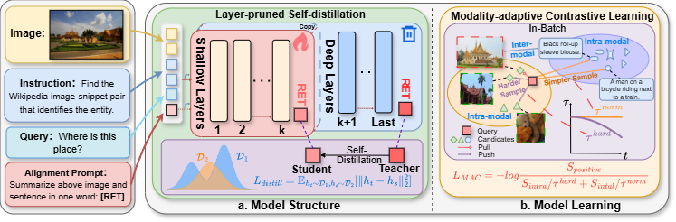

<div align="center">

<!-- <h1>JiuTian (九天) </h1> -->
<h2 class="papername">  PUMA: Layer-Pruned Language Model for Efficient Unified Multimodal Retrieval with Modality-Adaptive Learning</h2>
<div>
<div>
    <a href="https://weberLyu.github.io" target="_blank">Yibo Lyu</a>,
    <a href="https://rshaojimmy.github.io/OrionLab/" target="_blank">Rui Shao*</a>,
    <a href="https://scholar.google.com/citations?user=Mpg0w3cAAAAJ&hl=en&oi=ao" target="_blank">Gongwei Chen</a>,
    <a href="https://scholar.google.com.hk/citations?user=0GtAUPoAAAAJ&hl=zh-CN&oi=sra" target="_blank">Yijie Zhu</a>,
    <a href="http://faculty.hitsz.edu.cn/guanweili" target="_blank">Weili Guan</a>,
    <a href="https://scholar.google.com/citations?hl=en&user=yywVMhUAAAAJ" target="_blank">Liqiang Nie*</a>
</div>
School of Computer Science and Technology, Harbin Institute of Technology, Shenzhen<br>
*Corresponding author


[](https://arxiv.org/abs/2507.08064)

</div>

</div>

## :fire: If you find this work useful for your research, please kindly cite our paper and star our repo.

## :fire: Introduction

This is the github repository of *PUMA: Layer-Pruned Language Model for Efficient Unified Multimodal Retrieval with Modality-Adaptive Learning*. To address the efficiency challenges of MLLM-based unified multimodal retrieval (UMR) in real-world applications. In this work, we propose **Layer-Pruned Self-Distillation** approach from the perspective of model structure. It structurally prunes the model by preserving only the shallow layers, substantially reducing the parameters of MLLM. We also propose **Modality-Adaptive Contrastive Learning** Loss (MAC-Loss) from the perspective of model learning. It adaptively separates in-batch negative candidate samples into harder intra-modality and easier inter-modality ones, and combines this with the dynamic temperature strategy to achieve cost-free hard negative sampling.

The framework of PUMA:

<div align="center">

</div>

## Installation
```python
# Create and activate conda environment
conda create -n puma python=3.10 -y
conda activate puma

# Clone our repo and pip install to download dependencies
git clone https://github.com/JiuTian-VL/PUMA.git
cd PUMA
pip install -r requirements.txt
```

## Training
Download [Qwen2-VL](https://huggingface.co/Qwen/Qwen2-VL-7B-Instruct), [M-BEIR](https://huggingface.co/datasets/TIGER-Lab/M-BEIR) dataset, and the pretraining dataset in this [link](https://huggingface.co/datasets/princeton-nlp/datasets-for-simcse).

Before training, please run ```notebook/copy_pre_layers.ipynb``` to prune and copy the first k layers.

Run the scripts to start training:
```python
# finetune stage1
bash scripts/train/finetune_distill.sh
```
```python
# merge lora in stage1
bash scripts/train/merge_lora.sh
```
```python
# finetune stage2
bash scripts/train/finetune_lora_stage2.sh
```


## Evaluation
```python
# Embedding
bash scripts/eval/embed.sh
# Evaluation
bash scripts/eval/eval.sh
```
We follow the evaluation in [UniIR](https://github.com/TIGER-AI-Lab/UniIR). 
Before evaluation, you should make sure ```index.yaml``` and ```retrieval.yaml``` correspond to the dataset being evaluated. 
We recommend you can embedding and evaluating a subset of the dataset. You can simply comment out the unnecessary datasets as needed. We also recommend use multi-GPU for inference.

## Acknowledgements
Many thanks to the code from [LamRA](https://github.com/Code-kunkun/LamRA) and [finetune Qwen](https://github.com/2U1/Qwen-VL-Series-Finetune).

## :fire: Citation

If you find this work useful for your research, please kindly cite our paper:

```
@inproceedings{lyu2025puma,
  title={Puma: Layer-pruned language model for efficient unified multimodal retrieval with modality-adaptive learning},
  author={Lyu, Yibo and Shao, Rui and Chen, Gongwei and Zhu, Yijie and Guan, Weili and Nie, Liqiang},
  booktitle={Proceedings of the 33rd ACM International Conference on Multimedia},
  pages={7653--7662},
  year={2025}
}
```
